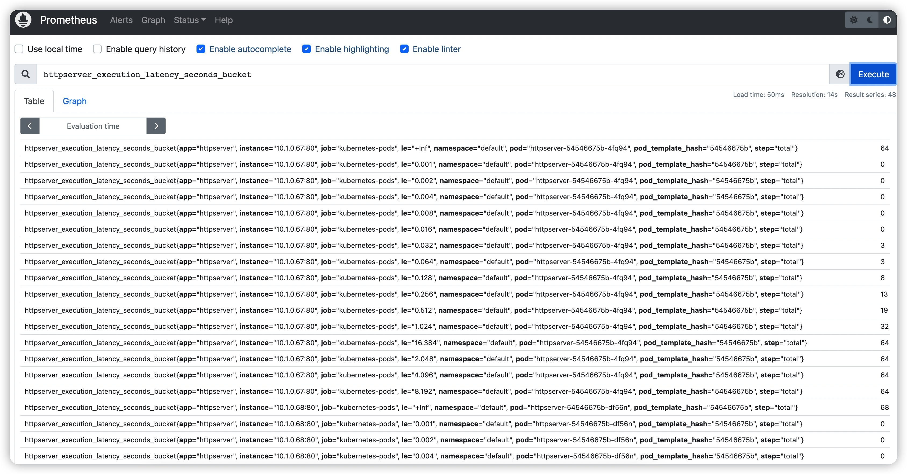
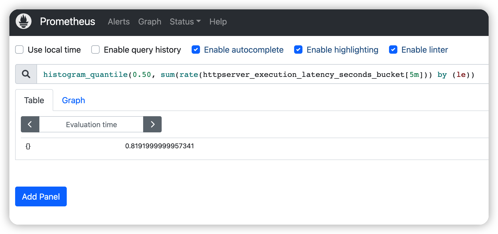
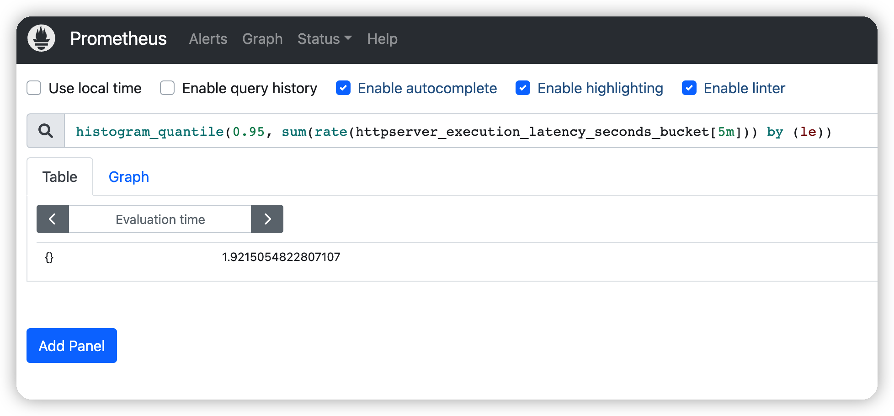

# Week10 的作业

## 作业的内容

1. 为 HTTPServer 添加 0-2 秒的随机延时；
2. 为 HTTPServer 项目添加延时 Metric；
3. 将 HTTPServer 部署至测试集群，并完成 Prometheus 配置；
4. 从 Promethus 界面中查询延时指标数据；
5. （可选）创建一个 Grafana Dashboard 展现延时分配情况。


### 1. 为 HTTPServer 添加 0-2 秒的随机延时；

```go
func rootHandler(w http.ResponseWriter, r *http.Request) {
	glog.V(4).Info("entering root handler")
	timer := metrics.NewTimer()
	defer timer.ObserveTotal()
	user := r.URL.Query().Get("user")
	delay := randInt(10, 2000)
	time.Sleep(time.Millisecond * time.Duration(delay))

	if user != "" {
		io.WriteString(w, fmt.Sprintf("hello"+user))
	} else {
		io.WriteString(w, fmt.Sprintf("hello stranger "))
	}
	io.WriteString(w, "============Details of the http request header ==============")
	for k, v := range r.Header {
		io.WriteString(w, fmt.Sprintf(k, v))
	}
	glog.V(4).Info("Respond in %d ms", delay)
}
```

### 2. 为 HTTPServer项目添加延时  Metric；
路径：
Week10/homework/httpserver/metrics 下

代码：metrics.go

```go
package metrics

import (
	"fmt"
	"github.com/prometheus/client_golang/prometheus"
	"time"
)

type ExecutionTimer struct {
	histo *prometheus.HistogramVec
	start time.Time
	last  time.Time
}

func Register() {
	err := prometheus.Register(functionLatency)
	if err != nil {
		fmt.Println(err)
	}
}

const (
	MetricsNamespace = "httpserver"
)

var functionLatency = CreateExecutionTimeMetric(MetricsNamespace, "Time Spent")

func NewTimer() *ExecutionTimer {
	return NewExecutionTimer(functionLatency)
}

func CreateExecutionTimeMetric(namespace string, help string) *prometheus.HistogramVec {
	return prometheus.NewHistogramVec(
		prometheus.HistogramOpts{
			Namespace: namespace,
			Name:      "execution_latency_seconds",
			Help:      help,
			Buckets:   prometheus.ExponentialBuckets(0.001, 2, 15), // 指数级的桶，0.001开始，翻2倍，翻15次
		}, []string{"step"},
	)
}

func (t *ExecutionTimer) ObserveTotal() {
	(*t.histo).WithLabelValues("total").Observe(time.Now().Sub(t.start).Seconds())
}

func NewExecutionTimer(histo *prometheus.HistogramVec) *ExecutionTimer {
	now := time.Now()
	return &ExecutionTimer{
		histo: histo,
		start: now,
		last:  now,
	}
}

```

### 3. 将 HTTPServer 部署至测试集群，并完成 Prometheus 配置；

1. 安装Loki 等（包含Loki、Grafana、Prometheus）

```shell
helm repo add grafana https://grafana.github.io/helm-charts
helm fetch grafana/loki-stack
tar zxvf loki-stack-2.6.5.tgz

helm install loki ./loki-stack --set grafana.enabled=true,prometheus.enabled=true,prometheus.server.persistentVolume.enabled=false,prometheus.altermanager.persistentVolume.enabled=false
```

2. 更改Service

通过更改ClusterIP 为 NodePort的形式，曝露出端口和Web页面
```shell
kubectl edit svc loki-prometheus-server
kubectl edit svc loki-grafana
```

3. 查看信息（包含Loki、Grafana、Prometheus）

```shell
$ kubectl get pods -A
NAMESPACE     NAME                                            READY   STATUS             RESTARTS         AGE
default       httpserver-54546675b-4fq94                      1/1     Running            0                57m
default       httpserver-54546675b-df56n                      1/1     Running            0                57m
default       httpserver-54546675b-tsbsc                      1/1     Running            0                57m
default       loki-0                                          1/1     Running            0                33m
default       loki-grafana-69f455b8b4-8682p                   2/2     Running            0                33m
default       loki-kube-state-metrics-7448968777-6n64v        1/1     Running            0                33m
default       loki-prometheus-alertmanager-854965755d-9kg6h   2/2     Running            0                33m
default       loki-prometheus-pushgateway-dcb478496-hz65l     1/1     Running            0                33m
default       loki-prometheus-server-7cf7dcf794-rjjv2         2/2     Running            0                33m
default       loki-promtail-tg575                             1/1     Running            0                33m
```


```shell
$ kubectl get svc -A
NAMESPACE     NAME                            TYPE        CLUSTER-IP       EXTERNAL-IP   PORT(S)                      AGE
default       httpserver                      NodePort    10.111.152.182   <none>        80:30001/TCP                 57m
default       kubernetes                      ClusterIP   10.96.0.1        <none>        443/TCP                      25d
default       loki                            ClusterIP   10.102.41.72     <none>        3100/TCP                     33m
default       loki-grafana                    NodePort    10.102.214.196   <none>        80:30774/TCP                 33m
default       loki-headless                   ClusterIP   None             <none>        3100/TCP                     33m
default       loki-kube-state-metrics         ClusterIP   10.104.234.159   <none>        8080/TCP                     33m
default       loki-memberlist                 ClusterIP   None             <none>        7946/TCP                     33m
default       loki-prometheus-alertmanager    ClusterIP   10.104.93.219    <none>        80/TCP                       33m
default       loki-prometheus-node-exporter   ClusterIP   None             <none>        9100/TCP                     33m
default       loki-prometheus-pushgateway     ClusterIP   10.105.172.35    <none>        9091/TCP                     33m
default       loki-prometheus-server          NodePort    10.104.14.36     <none>        80:31715/TCP                 33m
kube-system   kube-dns                        ClusterIP   10.96.0.10       <none>        53/UDP,53/TCP,9153/TCP       25d
```


4. 查询Grafan的密码，账号默认为admin

```shell
kubectl get secret --namespace default loki-grafana -o jsonpath="{.data.admin-password}" | base64 --decode ; echo
```

5. 登录Grafana、Prometheus

### 4. 自动请求的脚本

其中：30001是httpserver 的service 的NodePort曝露出来的端口，发送200个请求便于生成Prometheus的数据、Grafana便于观察

```shell
#!/bin/bash
for ((i=1;i<=200;i++));
do
    curl 127.0.0.1:30001/hello
    sleep 2
done
```

### 5. 从 Promethus 界面中查询延时指标数据；

延时数据：

```PromQL
httpserver_execution_latency_seconds_bucket
```



聚合查询：

```PromQL
histogram_quantile(0.50, sum(rate(httpserver_execution_latency_seconds_bucket[5m])) by (le))
```




```PromQL
histogram_quantile(0.90, sum(rate(httpserver_execution_latency_seconds_bucket[5m])) by (le))
```


```PromQL
histogram_quantile(0.95, sum(rate(httpserver_execution_latency_seconds_bucket[5m])) by (le))
```



### 6. （可选）创建一个 Grafana Dashboard 展现延时分配情况。

只需要选择Prometheus的数据源，将上方的PromSQL 聚合查询的语句放入，设置查询最近5min数据，设置好图示，就可以了


结果图示：


#### 注意事项，一定要向上图一样，选择最近5分钟的数据，如果默认为6h的话，则看不出实际效果


